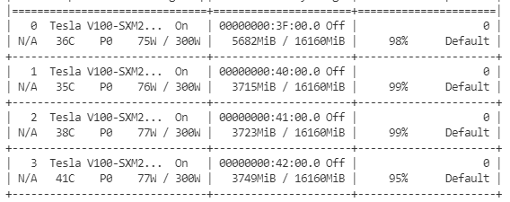
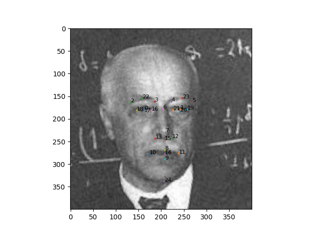

# MTCNN Face Alignment

The face alignment process is separated into two subprocesses:

1. Detect: get the landmarks from the image
2. Align: use the landmarks to align the face

These two subprocesses can be used separately, for example, if a dataset has provided landmarks, the `Detect` process could be omitted.


## Features

- Support multi-GPU multi-process detect or align.
- Support load landmarks from the dataset file directly.
- TODO: support face recognition in the detection process.


It takes about 5 hours to detect and align the whole MS1M dataset with 4 V100 GPUs.




## Detect

The MTCNN is utilized in this repo, please refer to `detect.py`

## Align

Align the face with landmarks provided by the dataset, take the MS1M dataset as an example:

```Python
from align_func import Align

def ms1m_landmark_func(folder, filename):
    landmark_file = os.path.join(folder, filename + '.SDMShape2')
    with open(landmark_file, 'r') as f:
        landmarks = f.read().strip().split('\n')[1:]
    landmarks = [i.split(' ')[1:] for i in landmarks]
    landmarks = [[float(i[0]), float(i[1])] for i in landmarks]
    return landmark_n_to_5(landmarks)

aligner = Align(crop_size=112)
aligner.align_list_of_folders('data/MS1M/MS1M_Origin', 'data/MS1M/align', ms1m_landmark_func)
```

If you do not know the landmark indexes, you could use `vis_landmark.py` to visualize landmarks. 



